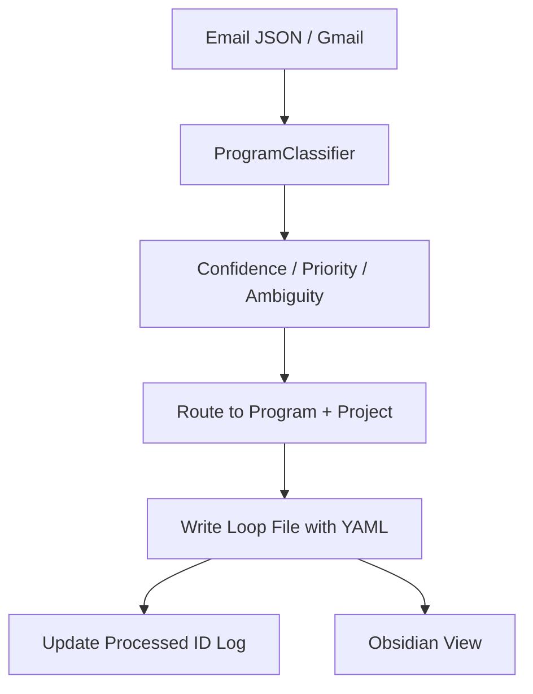

# 🔧 System Overview

The EA signal ingestion pipeline:
- Classifies incoming emails based on YAML-defined programs in `config/programs/`
- Routes each email to the correct loop file under the appropriate program/project
- Computes and records confidence, priority, and ambiguity for each signal
- Ensures idempotent processing (no duplicate signals)
- Stores structured loop memory in markdown files, fully aligned with EA/Obsidian conventions

---

## 📂 Directory Structure

- `config/programs/`: YAML configs for each program (domains, keywords, contacts, projects)
- `emails/`: input test data (JSON email dumps)
- `vault/`: loop output files, organized by program and project
- `tests/`: test suite for all pipeline logic and edge cases
- `scripts/` or root: main processor (`route_email_signals.py`), classifier modules, and helpers

---

## 📘 File Responsibilities

- **`route_email_signals.py`**: Main entry point. Loads emails, classifies them, computes confidence/priority/ambiguity, and writes to loop files. Supports CLI args for flexible paths.
- **`classifiers/program_classifier.py`**: Loads all program YAML configs, matches emails to programs/projects, computes confidence, ambiguity, and returns all context for routing.
- **`loop_writer.py`** (or equivalent): Handles loop file reading, writing, and markdown/YAML formatting (in this system, this is handled by `loop_markdown.py`).
- **`tests/test_multi_program_routing.py`**: Comprehensive test suite. Validates multi-program routing, ambiguity, idempotency, and output structure. Prints and asserts all key classification fields.

---

## 📥 Input Structure

Example email JSON:
```json
{
  "id": "abc123",
  "from": "jane@partner.com",
  "subject": "Confirm RSVP for launch",
  "body": "Please confirm attendee list.",
  "date": "2025-05-27",
  "has_attachment": false
}
```

---

## 🗺️ Signal Pipeline Flow (Mermaid)

